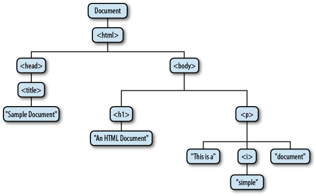

# ECMAScript vs. Javascript vs. DOM vs. BOM
## ECMAScript
### 要明确的
网景开发的Javascript火了之后，ECMA组织制定的Javascript语言的标准，称作是ECMAScript标准。
### 要知道的
- ECMAScript可以对各种各样的主机（host）环境提供核心脚本功能，因此脚本语言并不是特定属于任何一个主机环境的。
- 每个浏览器都有自己的一套对ECMAScript接口的实现。这也是它们对不同版本的ECMAScript、每个版本的ECMAScript中的方法支持度不同的原因。
## Javascript
### 要明确的
网景对ECMAScript标准的实现。
### 要知道的
一个完整的JavaScript实现由三个不同的部分构成

- 核心部分 （基于ECMSScript标准）
- DOM（文档对象模型）
- BOM（浏览器对象模型）

## DOM
### 要明确的
- DOM是表示和操作HTML和XML文档的基础API（应用编程接口）
- DOM是一种适用于多种环境和多种程序设计语言的通用性API，并不仅限于JavaScript
- 对于web浏览器来说，DOM已经根据ECMAScript标准实现，也是组成Js的一部分
### 要知道的
- DOM提供了一种文档的结构化表示(DOM树，如下图)，定义了此结构可以被程序访问的方式，因此程序可以改变文档的结构、样式和内容。

- 拓展：Window对象 & Document对象 & DOM
    - 我们知道每一个浏览器窗口、标签页和框架由一个Window对象所表示。
    - 每个Window对象都有一个document属性引用了Document对象。
    - Document对象表示窗口的内容。
    - Document对象并非独立，它是DOM中的核心对象

## BOM
### 要明确的
- 浏览器有着一个BOM（浏览器对象模型）来允许访问和控制浏览器窗口。
- 因为没有一个明确的实现标准，所以每个浏览器实现的BOM都不同。
### 要知道的
- 开发人员可以通过BOM来进行对Window对象的访问、控制。BOM包含一些Window对象，因此也包含一系列Window的方法和其属性引用的对象。Document对象就是其中的一个。

>
参考：

《JavaScript权威指南》

[JavaScript Vs DOM Vs BOM, relationship explained](https://vkanakaraj.wordpress.com/2009/12/18/javascript-vs-dom-vs-bom-relationship-explained/)

[Overview of the DOM](https://www.safaribooksonline.com/library/view/javascript-the-definitive/9781449393854/ch15s01.html)

[什么是BOM](http://www.dreamdu.com/javascript/what_is_bom/)

>